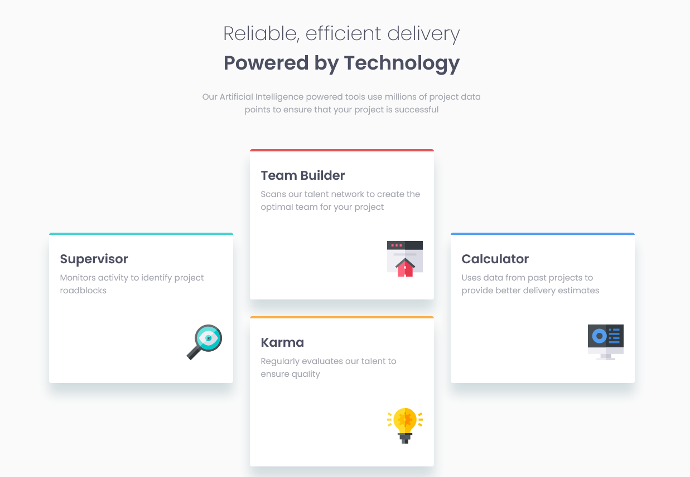

# Frontend Mentor - Four card feature section solution

This is a solution to the [Four card feature section challenge on Frontend Mentor](https://www.frontendmentor.io/challenges/four-card-feature-section-weK1eFYK).

## Table of contents

- [Overview](#overview)
  - [The challenge](#the-challenge)
  - [Screenshot](#screenshot)
  - [Links](#links)
- [My process](#my-process)
  - [Built with](#built-with)
  - [What I learned](#what-i-learned)
  - [Continued development](#continued-development)
  - [Useful resources](#useful-resources)
- [Author](#author)

## Overview

### The challenge

Users should be able to:

- View the optimal layout for the site depending on their device's screen size

### Screenshot



### Links

- Live Site URL: [https://lucasepk.github.io/four-card-feature-section/](https://lucasepk.github.io/four-card-feature-section/)

## My process

### Built with

- Semantic HTML5 markup
- CSS
- CSS Grid

### What I learned

Use this section to recap over some of your major learnings while working through this project. Writing these out and providing code samples of areas you want to highlight is a great way to reinforce your own knowledge.

Learnt a lot about semantic HTML, kinda proud of how my html body turned out

```html
  <header>
    <h1 class="big_header">Reliable, efficient delivery <span class="big_header_bold">Powered by Technology</span></h1>
    <p class="subtitle">Our Artificial Intelligence powered tools use millions of project data points to ensure that your project is successful</p>
  </header>

  <main>
    <section class="container">
      <div class="card" id="supervisor">
        <h2 class="normal_header">Supervisor</h2>
        <p class="normal_txt">Monitors activity to identify project roadblocks</p>
        
      </div>

      <div class="card" id="team_builder">
        <h2 class="normal_header">Team Builder</h2>
        <p class="normal_txt">Scans our talent network to create the optimal team for your project</p>
        
      </div>

      <div class="card" id="karma">
        <h2 class="normal_header">Karma</h2>
        <p class="normal_txt">Regularly evaluates our talent to ensure quality</p>
        
      </div>

      <div class="card" id="calculator">
        <h2 class="normal_header">Calculator</h2>
        <p class="normal_txt">Uses data from past projects to provide better delivery estimates</p>
        
      </div>
    </section>
  </main>
```

Put some grid knowledge to practice to make the cards look like they do on the design, and I'm kinda proud of that

```css
section{
    /*we define section as a grid with 4 rows and 6 columns*/
    display: grid;
    grid-template-rows: repeat(4, 120px);
    grid-template-columns: repeat(6, 150px);
    gap: 2em;
}

#supervisor{
    grid-area: 2 / 1 / 4 / 3;
}

#team_builder{
    grid-area: 1 / 3 / 3 / 5;
}

#calculator{
    grid-area: 2 / 5 / 4 / 7;
}

#karma{
    grid-area: 3 / 3 / 5 / 5;
}
```

### Continued development

I'd like to continue using CSS grid because I'm really enjoying how it works, i prefer it over Flexbox.

### Useful resources

- [https://youtu.be/EiNiSFIPIQE](https://youtu.be/EiNiSFIPIQE) - Very useful video about CSS grid
- [https://www.youtube.com/watch?v=NexL5_Vdoq8](https://www.youtube.com/watch?v=NexL5_Vdoq8) - Useful video about how to use headings
- [https://www.youtube.com/watch?v=bOUhq46fd5g](https://www.youtube.com/watch?v=bOUhq46fd5g) - Very useful video about semantic HTML

## Author

- Frontend Mentor - [@LucasEPK](https://www.frontendmentor.io/profile/LucasEPK)
